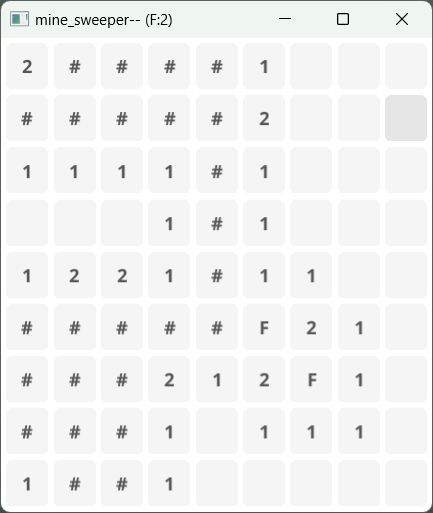

# mine_sweeper_go



## About this code

This code is my Go lang programming practice.

## Dependency

- [fyne](https://github.com/fyne-io/fyne)

## Compilation

```bash
fyne build .
```

## ToDo

- [x] Right click flag function
- [ ] Fix Game Over dialog
- [x] Prevent sudden death
